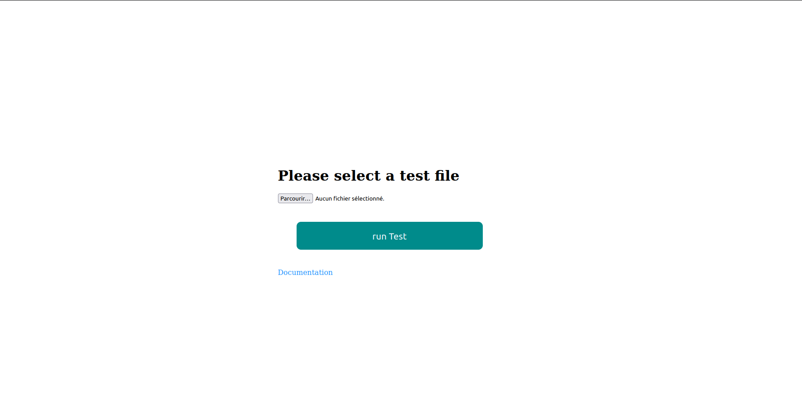
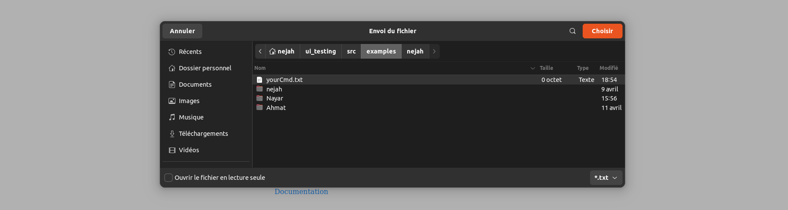
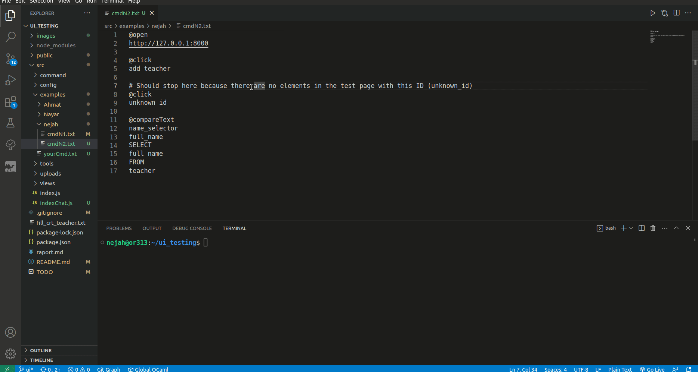

# ui_testing

## First use 
1. Go to [db.js](./src/config/db.js) and change it to your own values.
2. Add <code> db.js </code> to [gitignore](.gitignore)
3. Change the value of the **port** variable (if desired) in [index.js](./src/index.js)

## Installation 
npm install

## RUN 
> cd src 

> node [index.js](./src/tests/index.js)

## Usage :
*  Please read the documentation of the meta language before proceeding to [doc](./public/documentation.html).
* You can find some examples in [here](./src/examples/) starting with the [simple example](./src/examples/nejah/cmdN1.txt).
* Create your own cmd.txt file.

* After that, open your listening server by going to <code> http://localhost:8081</code>(default). 

Normally, you should see this page:

Select your cmd file:

Then, click on the **Run Test** button.

### A demonstation using [cmdN2.text](./src/examples/nejah/cmdN2.txt) file

